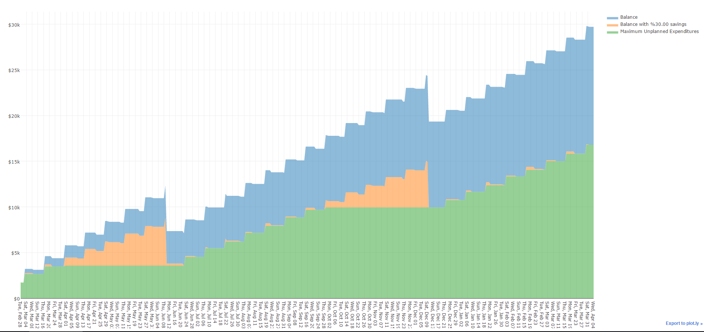

# Projected Balance Calculator

Creates a plot of the projected balances of an account based on one-time and recurring transactions.
To configure, go into the code and define your transactions in the main function (should be easy to figure out what needs to be done based on the tests). Transaction objects can take either a [dateutil.rrule](https://dateutil.readthedocs.io/en/stable/rrule.html) or a plain datetime.

Here's a demo image

## Dependencies
* [python-dateutil](https://pypi.python.org/pypi/python-dateutil)
* [plotly](https://pypi.python.org/pypi/plotly)

## TODO
Considering this is mostly just for my own budgetary needs, these will be implemented as I desire

* Targets for specific dates
* Highlight or print warnings if drop below 0
* Handle multiple accounts (separate or same plot?)
* Reading from a text file
* Move tests to separate file